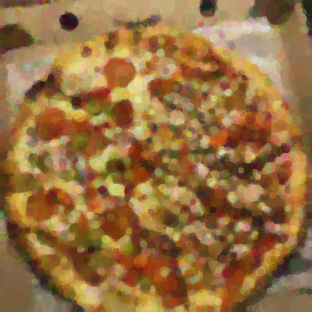
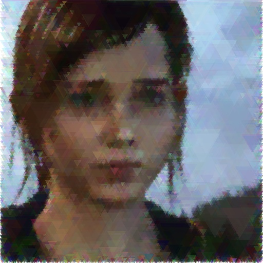
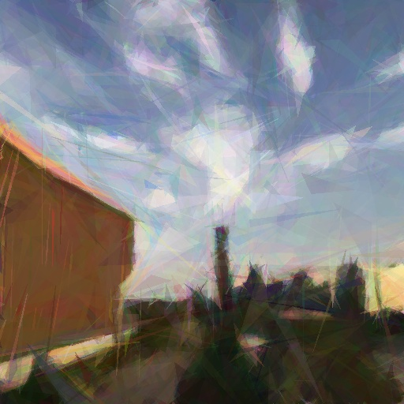

## An evolution algorithm generating images similar to input image using one of the brushes

### Examples:

|                      |                      |                      |                      |
| -------------------- | -------------------- | -------------------- | -------------------- |
|  |  |  |  |


#### In order to run

```shell
#! for using virtual environment
python -m venv evo && source evo/bin/activate
	
pip install -r requirements.txt
python evo.py -h
```

or

```shell
#! for using virtual environment
python3 -m venv evo && source evo/bin/activate

pip3 install -r requirements.txt
python3 evo.py -h
```

### Usage

#### Have [ffmpeg](https://www.ffmpeg.org/download.html) installed for making timalapses

```shell
$ brew install ffmpeg
$ sudo apt install ffmpeg
```

```shell
usage: evo.py [-h] [--keepsize] [--iterations ITERATIONS] [--timelapse]
              [--population POPULATION]
              imageName {c,t,p,sp}
              
Use either .jpg or .png images with resolution of 512x512

positional arguments:
  imageName             filename of an image in current directory
  {c,t,p,sp}            c – circle, t – triangle, p – random polygon, sp – smart polygon

optional arguments:
  -h, --help            show this help message and exit
  --keepsize, -s        keep original resolution (default: False)
  --iterations ITERATIONS
                        optional (default: 5000)
  --timelapse, -t       making a timelapse in mp4 format at the end, ffmpeg required
                        (default: False)
  --population POPULATION
                        optional (default: 512)
```

### Examples

```shell
python3 evo.py image.jpg c
python3 evo.py image.png sp
python3 evo.py image.jpg p --timelapse
python3 evo.py pic.png c --population 256 --keepsize
python3 evo.py image.jpg c -iteration 4000
```

### Notice

The algorithm is not optimised for GPU or multiple CPU cores. With image resolution of approximately 256x256 it will take around 30 minutes. For 512x512 around 3-4 hours etc.